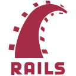

### <samp>Hey, there! 👋 </samp>

<samp>I'm a highly motivated and dynamic Full Stack Web Developer from Morocco 🇲🇦.. I am passionate about Web Development and open source. 🤗 I’m looking forward to collaborating on any Open Source projects, so please feel free to contact me.</samp>

> The power of Open Source is the power of the people. The people rule.
>
> -- <cite>Philippe Kahn</cite>

### <samp>I am currently working with 👇 </samp>

 

